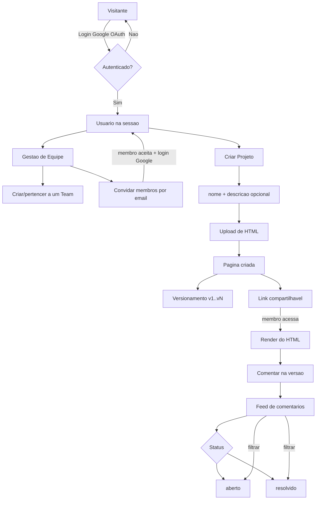

# SEED — Almanak

> ## Passo 0 — Auto-bootstrap (o AGENT executa isto ANTES de qualquer coisa) — MUST
> Esta SEED faz parte de um **repositorio**. As regras (`AGENTS.md`) e os procedimentos
> (`.claude/skills/`) precisam estar em disco. Antes de implementar, o agent **MUST** garantir
> que tem o repo completo:
>
> ```
> # 1. O diretorio atual ja contem AGENTS.md E .claude/skills/ ?
> #    SIM -> voce ja tem o repo (alguem clonou/te apontou pra ele). Prossiga.
> #    NAO -> voce recebeu so o texto desta SEED. Clone o repo e trabalhe de dentro dele:
> git clone https://github.com/impeto-ai/almanac-seed && cd almanac-seed
> ```
>
> Apos garantir o repo: leia `AGENTS.md` (regras + agentic build protocol) e siga as skills em
> `.claude/skills/` na ordem. So entao comece a implementar.
>
> Isso cobre os dois cenarios: (a) colaram so o texto da SEED -> o agent clona e se completa;
> (b) trouxeram o repo -> o agent detecta os arquivos no filesystem e prossegue. Mesmo padrao do
> OpenAI Symphony (que clona o repo no workspace via hook `after_create`).
>
> O harness tambem le instrucoes automaticamente: Claude Code -> `CLAUDE.md` + skills;
> Codex/Cursor/etc -> `AGENTS.md`.

---

> Esta SEED e a **receita completa** do software Almanak. O agent DEVE materializar a aplicacao
> funcional do zero, lendo `AGENTS.md` (regras) antes de implementar. A SEED so e considerada
> germinada quando TODOS os criterios de aceite (Secao 14) passam e o deploy responde em
> producao (Secao 19).

---

## 1. Normative Language

As palavras-chave **MUST**, **MUST NOT**, **REQUIRED**, **SHOULD**, **SHOULD NOT**,
**RECOMMENDED**, **MAY** e **OPTIONAL** neste documento devem ser interpretadas conforme a
RFC 2119. Requisitos marcados `MUST` sao gates de conformidade: o software NAO esta pronto
enquanto qualquer `MUST` falhar.

## 2. Problem Statement

Designers e times de produto compartilham mockups em HTML de forma ineficiente (anexar
arquivo no Slack, baixar, abrir, e repetir a cada nova versao). O Almanak resolve isso:
um espaco web onde um membro faz upload de um HTML, gera um link compartilhavel, o time
visualiza o HTML renderizado no browser, comenta sobre versoes especificas e acompanha o
status dos feedbacks — sem baixar arquivo nenhum.

## 3. Goals and Non-Goals

### Goals
- Login via Google.
- Gestao de equipe (criar team, convidar membros, membros logam e acessam).
- Upload de arquivo HTML e renderizacao no browser.
- Versionamento de paginas (cada novo upload na mesma pagina = nova versao preservando as anteriores).
- Link compartilhavel por projeto.
- Comentarios vinculados a uma versao especifica, com status (aberto/resolvido) e filtro.

### Non-Goals
- Editar o HTML dentro do Almanak (e read-only / preview).
- Colaboracao em tempo real (websockets/cursores).
- Portal externo/publico sem autenticacao.
- Pagamentos, billing, planos.

## 4. System Overview

Aplicacao web single-page-experience servida pela Vercel, com persistencia e autenticacao
no Supabase. Toda a logica de dados passa pelo **client/SDK oficial do Supabase** (NAO usar
ORM — ver `AGENTS.md`). Hierarquia de dominio:

```
Team -> Project -> Option -> Version -> Comment(pin)
```
(Project tem status active/archived/shipped. Option = variacao/tela. Cada Version e um upload de HTML.)



## 5. Platform Prerequisites (CRITICO — NAO NEGOCIAVEL)

Estes sao os pontos criticos validados pelo avaliador. Se qualquer um falhar, a submissao
e desqualificada.

- O deploy **MUST** rodar na **Vercel** e responder em uma URL publica de producao.
- A persistencia **MUST** usar **Supabase** (PostgreSQL + Auth + Storage).
- O acesso ao banco **MUST** usar o **SDK/client oficial do Supabase**. O uso de ORM
  (Prisma, Drizzle, etc) **MUST NOT** ocorrer.
- A autenticacao **MUST** ser **Google OAuth via Supabase Auth**. Nenhum outro provedor e REQUIRED.
- Variaveis de ambiente **MUST** ser as listadas no Apendice A. O agent **MUST NOT**
  hardcodar segredos.

## 6. Core Domain Model

Campos tipados. O schema fisico (DDL) vive na migracao Supabase.

**User** (gerenciado pelo Supabase Auth + tabela profile)
```
id (uuid)            -- = auth.users.id
email (string)
name (string or null)
avatar_url (string or null)
created_at (timestamp)
```

**Team**
```
id (uuid)
name (string)
owner_id (uuid -> User.id)
created_at (timestamp)
```

**TeamMember**
```
id (uuid)
team_id (uuid -> Team.id)
user_id (uuid -> User.id)
role (enum: 'owner' | 'member')
invited_email (string or null)   -- preenchido em convite pendente
status (enum: 'pending' | 'active')
created_at (timestamp)
```

**Project**
```
id (uuid)
team_id (uuid -> Team.id)
name (string)
description (string or null)
status (enum: 'active' | 'archived' | 'shipped')  -- default 'active'
share_token (string, unico)      -- usado no link compartilhavel
created_at (timestamp)
```

**Option** (na UI aparece como "option" — uma variacao/tela dentro do projeto; ex: "Option 1", "frontend-team")
```
id (uuid)
project_id (uuid -> Project.id)
name (string)
created_at (timestamp)
```

**Version**
```
id (uuid)
option_id (uuid -> Option.id)
version_number (integer, 1-based, sequencial por option)
author_id (uuid -> User.id)      -- quem fez o upload desta versao
storage_path (string)            -- caminho do HTML no Supabase Storage
created_at (timestamp)
```
> A versao de maior `version_number` e a `LATEST`. A que o usuario esta vendo e a `CURRENT`.
> Hierarquia: Team -> Project -> Option -> Version -> Comment(pin).

**Comment** (= "pin" — nota flutuante ancorada no HTML renderizado)
```
id (uuid)
version_id (uuid -> Version.id)
author_id (uuid -> User.id)
body (string)
status (enum: 'open' | 'resolved')   -- default 'open'
pin_x (float or null)    -- posicao ancorada no preview (% relativo), null = comentario geral
pin_y (float or null)    -- posicao ancorada no preview (% relativo)
parent_id (uuid or null) -- thread/reply a outro comentario
resolved_at (timestamp or null)
created_at (timestamp)
```
> Um comentario com `pin_x/pin_y` aparece como um marcador flutuante sobre o HTML (estilo
> Figma/Google Docs). Comentarios formam threads via `parent_id` (reply).

## 7. Data Persistence Contract

- O HTML enviado **MUST** ser armazenado no **Supabase Storage**; a tabela `Version`
  guarda apenas o `storage_path`.
- Toda query/mutation **MUST** usar o client do Supabase (`@supabase/supabase-js` /
  `@supabase/ssr`). ORM **MUST NOT** ser introduzido.
- O `version_number` **MUST** ser sequencial e incremental por `page_id`.
- Migracoes **MUST** ser versionadas (arquivos SQL aplicaveis no Supabase).

## 8. Authentication Contract

- Login **MUST** ser Google OAuth configurado no Supabase Auth.
- Rotas de dados **MUST** exigir sessao autenticada; visitante anonimo **MUST NOT**
  acessar projetos.
- No primeiro login, o sistema **MUST** garantir um registro de profile do usuario.

## 9. Functional Specification

### 9.1 Gestao de Equipe
- Usuario autenticado **MUST** poder criar um Team (vira `owner`).
- Owner **MUST** poder convidar membros por email (cria `TeamMember` com status `pending`).
- Ao logar com email convidado, o membro **MUST** ter o vinculo promovido a `active` e
  passar a ver os projetos do team.

### 9.2 Projeto
- Usuario **MUST** criar Project ("New Project") com `name` (descricao OPTIONAL) dentro de um Team.
- Project **MUST** ter status `active`/`archived`/`shipped`, com filtro na listagem por esses status.
- Cada Project **MUST** ter um `share_token` que compoe um link compartilhavel.
- Membros do team **MUST** listar e abrir projetos existentes do team.
- Um Project contem N **Options** (variacoes/telas). A listagem mostra contagem de options e pins.

### 9.3 Upload e Versionamento (de um HTML)
- Usuario **MUST** poder fazer upload de um arquivo HTML dentro de uma Option, criando uma Version.
- "Add version" / novo upload na mesma Option **MUST** criar nova Version (`version_number` += 1)
  preservando as anteriores; cada Version registra o `author_id` (quem subiu) e o tempo.
- O usuario **MUST** poder trocar de versao via um **version switcher** (dropdown listando
  v1..vN com autor e tempo; a maior e `LATEST`, a exibida e `CURRENT`) e ver o HTML de cada uma.

### 9.4 Compartilhamento e Render
- Membro do team que acessa o link **MUST** visualizar o HTML renderizado no browser
  (preview, read-only). O HTML **SHOULD** ser renderizado de forma isolada (iframe sandbox).

### 9.5 Comentarios e Feedback (estilo Google Docs / Figma)

**Proposta de valor central:** ao clicar num ponto do HTML renderizado, o usuario deixa uma
nota EM CIMA daquele local — marcando exatamente onde quer a edicao. O feedback e posicional.

- Membro **MUST** comentar vinculado a uma Version especifica.
- Em "modo comentar", clicar sobre o preview **MUST** criar um pin ancorado naquela posicao
  (`pin_x/pin_y` como **% relativo** ao container do preview).
- **Aparencia do pin (MUST):** colapsado, o marcador **e o avatar da conta Google do autor**
  (foto circular). Ao clicar, o pin **expande** mostrando o card do comentario (autor, tempo,
  corpo, thread de replies, campo Reply, alternar resolved). Clicar no item do painel faz
  "jump to pin" (rola/destaca o marcador).

> **Mecanica tecnica (MUST — preserva seguranca):** o HTML do usuario e renderizado em
> `<iframe sandbox>`. Os pins NAO sao injetados no HTML do usuario (isso quebraria o sandbox e
> abriria XSS). Em vez disso, uma **camada de overlay** posicionada por cima do iframe captura
> o clique, converte para coordenada `%` relativa ao container e renderiza os marcadores. Assim
> o app nunca toca/executa o conteudo do usuario. Trade-off aceito no MVP: a ancora e relativa a
> viewport do preview (nao a um elemento do DOM do usuario).
- Comentarios **MUST** suportar reply (thread via `parent_id`).
- O painel lateral de comentarios **MUST** oferecer:
  - filtros: `ALL`, `OPEN`, `RESOLVED`, `RECENT`.
  - filtro por versao (v1..vN).
  - busca por autor ou corpo.
- Comentario **MUST** ter status `open`/`resolved`, alternavel.
- O autor do projeto e os membros **MUST** ver os comentarios e o autor de cada um (avatar/nome).
- **Identidade do autor (MUST):** todo pin/comentario e atribuido ao usuario autenticado via
  Google. `Comment.author_id` **MUST** ser igual a `auth.uid()` da sessao — imposto por RLS no
  insert (o cliente NAO pode forjar autor). O pin e o painel **MUST** exibir o nome e o avatar
  vindos da conta Google (`profiles.name` / `profiles.avatar_url`, populados no primeiro login).

### 9.6 Activity (SHOULD — enriquecimento)
- O painel **SHOULD** ter uma aba `Activity` (separada de `Comments`) registrando eventos por
  usuario e versao (ex: "Daniel viewed v4 just now", "commented", "resolved").
- Atalho **SHOULD**: segurar `Alt/Option` ("hold ⌥ to comment") para entrar em modo comentario.
- Comentarios **SHOULD** ter numero sequencial (#47) e badge da versao (v4).
- Reactions em comentarios **SHOULD** existir (filtro `REACTIONS` no painel).

## 10. State Machine

Comment:
```
open  --resolver-->  resolved
resolved  --reabrir-->  open
```

## 11. UI / Views (minimo REQUIRED)

- Tela de login (botao Google).
- Dashboard: lista de projetos do team com filtro de status (active/archived/shipped) + "New Project".
- Tela de team: membros + convite.
- Tela de projeto: lista de Options (com contagem de versions/pins) + "New Project"/upload + link compartilhavel.
- Tela de option/versao: breadcrumb (Project / Option / Version), **version switcher** (dropdown
  v1..vN com autor+tempo, badges LATEST/CURRENT, "Add version"), render do HTML em iframe sandbox,
  pins flutuantes (avatar do autor) sobre o preview, e painel lateral Comments/Activity com filtros.

## 12. Security and RLS

- RLS **MUST** estar habilitado em todas as tabelas de dominio.
- Um usuario **MUST NOT** ler ou escrever dados de um Team do qual nao e membro.
- O `share_token` **MUST** permitir acesso somente a membros autenticados do team dono do projeto.
- Segredos **MUST** viver em env vars; chaves service-role **MUST NOT** ir para o client.

## 13. Reference Algorithms (language-agnostic)

**Upload de HTML cria versao:**
```
function upload_html(option_id, file):
  assert user_is_team_member(option_id)
  next = max(version_number where Version.option_id == option_id) + 1   # 1 se vazio
  path = storage.put("options/{option_id}/v{next}.html", file)
  Version.insert({ option_id, version_number: next, author_id: current_user, storage_path: path })
```

**Criar comentario em versao:**
```
function add_comment(version_id, body, parent_id=null):
  assert user_is_team_member_of_version(version_id)
  Comment.insert({ version_id, author_id: current_user, body, status: 'open', parent_id })
```

**Criar pin a partir de clique no preview (overlay, sem tocar o HTML do usuario):**
```
# overlay e uma camada absoluta SOBRE o <iframe sandbox> do preview
on overlay_click(event):
  rect = overlay.getBoundingClientRect()
  pin_x = (event.clientX - rect.left) / rect.width * 100   # % relativo
  pin_y = (event.clientY - rect.top)  / rect.height * 100
  body  = prompt_user_for_note()
  Comment.insert({ version_id, author_id: current_user, body, status:'open', pin_x, pin_y })

function render_pins(version_id):
  for c in Comment.where(version_id, pin_x not null):
    place_marker_at(left = c.pin_x + "%", top = c.pin_y + "%")   # na camada overlay
```

**Convidar membro:**
```
function invite(team_id, email):
  assert current_user == Team.owner_id
  TeamMember.insert({ team_id, invited_email: email, role: 'member', status: 'pending' })

function on_login(user):
  ensure_profile(user)
  TeamMember.update(status='active', user_id=user.id) where invited_email == user.email
```

## 14. Acceptance Criteria (os gates `MUST`)

| # | ID | Criterio | Como verificar |
|---|----|----------|----------------|
| 1 | AUTH | Login exclusivo via Google OAuth (Supabase Auth). Anonimo nao acessa projeto | Logar com Google; tentar acessar rota protegida deslogado -> bloqueado |
| 2 | TEAM | Criar team + convidar membro; membro loga e ve projetos do team | Fluxo de convite ponta a ponta |
| 3 | PROJECT | Criar projeto com nome; gera link compartilhavel | Criar projeto, copiar link |
| 4 | UPLOAD | Upload de HTML cria pagina e renderiza no browser | Subir .html, ver render |
| 5 | VERSION | Novo upload cria nova versao preservando anteriores (v1..vN navegaveis) | Subir 2x, navegar entre versoes |
| 6 | SHARE | Membro acessa pelo link e ve HTML renderizado | Abrir link como segundo usuario do team |
| 7 | COMMENT | Comentario ancorado como pin flutuante no HTML + reply (thread); jump to pin | Criar pin na v2, abrir pelo marcador, responder |
| 8 | STATUS | Status open/resolved + painel com filtros ALL/OPEN/RESOLVED/RECENT, por versao e busca | Resolver comentario, filtrar e buscar |
| 9 | RLS | Membro de um team nao ve projeto de outro team | Tentar acessar dado de team alheio -> negado |
| 10 | DEPLOY | App em producao na Vercel, com Supabase e Google funcionando | Abrir URL Vercel, executar fluxo completo |

## 15. Test and Validation Matrix

O agent **MUST** produzir e executar uma matriz que testa cada criterio da Secao 14 e
registra `PASS`/`FAIL` com evidencia (passo executado + resultado). A matriz **MUST** ser
re-executavel.

## 16. Build Loop (Definition of Done) — NORMATIVO

> Esta secao e o que diferencia esta SEED de uma spec passiva. O agent **MUST** operar
> em loop ate o Definition of Done passar inteiro.

1. O agent **MUST** implementar conforme as Secoes 4-13.
2. O agent **MUST** executar a Validation Matrix (Secao 15) contra os 10 criterios (Secao 14).
3. Para cada criterio `FAIL`, o agent **MUST** corrigir a implementacao e **MUST** re-executar
   a matriz inteira.
4. O agent **MUST NOT** declarar a tarefa concluida enquanto:
   - qualquer criterio `MUST` estiver `FAIL`, OU
   - o deploy de producao (Vercel) nao responder executando o fluxo completo
     (login Google -> criar team -> projeto -> upload -> versao -> compartilhar -> comentar -> resolver).
5. **Definition of Done = todos os 10 criterios `PASS` + deploy de producao verificado.**
   Auto-verificacao e REQUIRED, nao OPTIONAL.

## 16.1 Human-in-the-loop Checkpoints (pausas esperadas, NAO falhas)

Alguns passos sao impossiveis para um agent executar sozinho (UI interativa de terceiros,
OAuth interativo). Estes sao **pre-definidos** como pausas no fluxo: o agent faz tudo que e
automatizavel, entao PAUSA com um pedido conciso e exato, registra no workpad como
`waiting on human: H#`, e **retoma** assim que destravado. Nao e bloqueador de falha — e
iteracao planejada.

| # | Onde | Por que o agent nao faz sozinho | O que o humano faz | Agent retoma fazendo |
|---|------|----------------------------------|--------------------|----------------------|
| H1 | Criar Google OAuth Client | Google Cloud Console (consent screen + criar credencial) e UI interativa | Cria OAuth Client (Web), informa `CLIENT_ID`/`SECRET`, adiciona redirect URI `https://<ref>.supabase.co/auth/v1/callback` | Configura o provider Google no Supabase (via Management API/token) e segue |
| H2 | Habilitar provider Google no Supabase | Automatizavel se houver `SUPABASE_ACCESS_TOKEN`; senao precisa do dashboard | Se sem token: habilita Google no dashboard e cola client id/secret | Segue para implementacao |
| H3 | Validar AUTH (login Google) | OAuth interativo nao automatizavel sem conta/sessao de teste | Faz login Google uma vez OU fornece conta/sessao de teste | Continua `e2e-verify` dos criterios 2..8 |
| H4 | Smoke de producao | Login Google em producao e interativo | Faz o login na URL de producao uma vez | Fecha o `acceptance-loop` (criterio 10 DEPLOY) |

Regra: o agent **MUST** chegar ao checkpoint com tudo o mais pronto (todo o automatizavel feito),
pausar com instrucao exata, e **MUST** retomar e continuar o loop apos o humano agir. Os demais
criterios (PROJECT, UPLOAD, VERSION, COMMENT/pin, STATUS, RLS) sao 100% automatizaveis e NAO
dependem de humano.

## 17. Implementation Checklist

- [ ] Projeto Supabase criado (DB + Auth + Storage), Google OAuth provider configurado
- [ ] Migracoes SQL com as 6 tabelas de dominio + RLS habilitado
- [ ] Auth Google funcionando + criacao de profile no primeiro login
- [ ] CRUD de Team + fluxo de convite
- [ ] CRUD de Project + share_token + link
- [ ] Upload HTML -> Storage -> Page/Version
- [ ] Versionamento sequencial + navegacao entre versoes
- [ ] Render isolado (iframe sandbox) do HTML
- [ ] Comentarios por versao + status + filtro
- [ ] RLS validado (acesso cross-team negado)
- [ ] Deploy Vercel + env vars + smoke test do fluxo completo
- [ ] Validation Matrix executada com todos PASS

## 18. Failure Model

- Upload de arquivo nao-HTML **MUST** ser rejeitado com mensagem clara.
- Falha de auth **MUST** redirecionar ao login sem vazar dados.
- Acesso nao autorizado **MUST** retornar negacao (sem expor existencia do recurso).

## 19. Deployment Contract

- Build **MUST** passar e a app **MUST** estar acessivel em URL de producao na Vercel.
- As env vars (Apendice A) **MUST** estar configuradas na Vercel e no Supabase.
- Um smoke test do fluxo completo **MUST** rodar com sucesso em producao.

## 5.1 Secrets e Provisionamento (como a SEED recebe credenciais)

A SEED **MUST NOT** conter nenhuma credencial. Segue o modelo do Symphony: os segredos vivem
no **ambiente do agent que germina a seed**, nunca no repositorio.

- O agent **MUST** ler as credenciais das variaveis de ambiente (Apendice A). Se uma credencial
  REQUIRED estiver ausente, o agent **MUST** parar e reportar o bloqueador (qual credencial,
  por que bloqueia), sem inventar valor. (Equivalente ao "blocked-access escape hatch" do Symphony.)
- Credenciais necessarias para germinar:
  - **Supabase:** um access token (`sbp_...`) para criar/configurar o projeto via CLI/MCP, OU um
    projeto ja existente expondo `URL` + `ANON_KEY` + `SERVICE_ROLE_KEY`.
  - **Google OAuth:** `CLIENT_ID` + `CLIENT_SECRET` criados no Google Cloud Console (ver skill `google-oauth`).
  - **Vercel:** `VERCEL_TOKEN` (+ org/project) para deploy de producao.
- O `SUPABASE_SERVICE_ROLE_KEY` **MUST** permanecer server-side; **MUST NOT** ir para o bundle do client.
- O avaliador/operador que cola a SEED e quem prove as credenciais no ambiente. A SEED apenas
  **declara** o que precisa (Apendice A) e **falha alto** se faltar.

## Apendice A — Variaveis de Ambiente

```
NEXT_PUBLIC_SUPABASE_URL=
NEXT_PUBLIC_SUPABASE_ANON_KEY=
SUPABASE_SERVICE_ROLE_KEY=        # somente server-side, nunca no client
GOOGLE_OAUTH_CLIENT_ID=           # configurado no Supabase Auth provider
GOOGLE_OAUTH_CLIENT_SECRET=       # configurado no Supabase Auth provider
```

## Apendice B — Extensoes (OPTIONAL)

- Diff visual entre versoes.
- Notificacao de novo comentario por email.
- Reacoes em comentarios.
